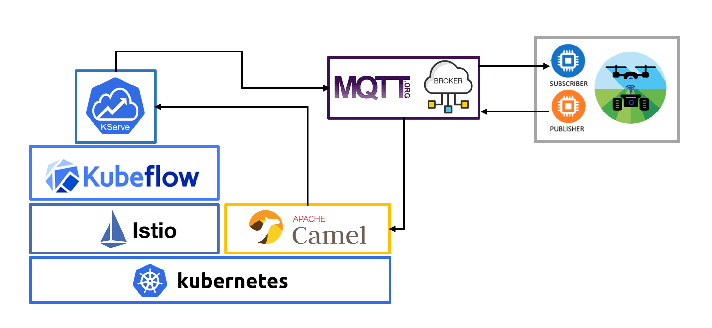

# Using inference services in the edge

Kubeflow's authentication system limits the use of KServe inference services
from outside the cluster by unauthenticated users/clients.
It is possible to overcome this limitation by using inference services over MQTT.
By doing this, an MQTT client can interact with the model by sending requests to
the server using a specific topic.
To do this, it is required to deploy an HTTP-MQTT *connector* (such as Apache Camel K),
and use an existing MQTT broker.
This guide compiles the required configuration steps.

## Mosquitto in Kubernetes (with Traefik)

This part of the guide describes how to deploy a
[Mosquitto](https://mosquitto.org/)
MQTT broker in Kubernetes using
[Traefik](https://traefik.io/)
as ingress controller (assuming it is already deployed and configured).
The applied configuration is partially based on the following articles:

- https://www.intuz.com/blog/how-to-deploy-mqtt-broker-in-a-kubernetes-cluster

- https://sko.ai/blog/how-to-run-ha-mosquitto/

### Extend Traefik configuration

First of all, it is required to modify the existing Traefik deployment
to create new `entrypoints` for MQTT.

Note: this guide explains how to configure two `entrypoints` for `mqtt`
(`tcp`) and `websockets` protocols using two different interfaces (ports).
This might not be the case for other projects where only one of those would
be required.
More information on MQTT WebSockets (in Mosquitto) ca be found
[here](https://cedalo.com/blog/enabling-websockets-over-mqtt-with-mosquitto/).

- Edit the existing Traefik service as follows:

  ```diff
  @@ -41,6 +41,16 @@
      port: 8080
      protocol: TCP
      targetPort: 9080
  +  - name: mqtt
  +    port: 5883
  +    protocol: TCP
  +    targetPort: 5883
  +  - name: wss
  +    port: 5884
  +    protocol: TCP
  +    targetPort: 5884
    selector:
      app: traefik
    sessionAffinity: None
  ```

- Edit the existing Traefik deployment as follows:

  ```diff
  @@ -50,6 +50,7 @@
      spec:
        containers:
        - args:
          . . .
          - --entrypoints.web.address=:8000/tcp
          - --entrypoints.websecure.address=:8443/tcp
  +        - --entrypoints.mqtt.address=:5883/tcp
  +        - --entrypoints.wss.address=:5884/tcp
          - --api.dashboard=true
          - --ping=true
          - --metrics.prometheus=true
  @@ -83,6 +84,9 @@
          name: traefik
          ports:
          . . .
          - containerPort: 8443
            name: websecure
            protocol: TCP
  +        - containerPort: 5883
  +          name: mqtt
  +          protocol: TCP
  +        - containerPort: 5884
  +          name: wss
  +          protocol: TCP
          readinessProbe:
            failureThreshold: 1
            httpGet:
  ```

In this project, ports `5883` and `5884` has been used, but this can be modified depending on the existing configuration.

### Mosquitto pre-configuration steps

Install `mosquitto` on your own host. This is just to complete the
configuration steps. Mosquitto broker will not be deployed this way.

```bash
$ sudo apt install mosquitto
```

Now, use `mosquitto_passwd` tool to generate desired MQTT-client credentials.
More information about this tool
[here](https://manpages.ubuntu.com/manpages/bionic/man1/mosquitto_passwd.1.html).

```bash
$ touch credentials.txt
$ mosquitto_passwd credentials.txt <USER>
```

This will fill `credentials.txt` file with the provided user name and the token
corresponding to the (requested) password. Example:

```bash
$ cat credentials.txt
admin:$6$84So0kRNW3ir+qd0$HFDYvYZ9CMM25ocu41YkTX2aXyGZBlkxFAblu2GRXh+/EMq88rEGX2nJYU+oJK2fzX8VzQK8wStEgMhHwjfHAg==
```
It is possible to run `mosquitto_passwd` tool over and over to generate more
client credentials.

### Kubernetes deployment

#### Configuring Mosquitto MQTT Broker

The desired configuration in Mosquitto is applied using two ConfigMaps
you can find in [./resources/mosquitto](./resources/mosquitto).

- [cm-mosquitto-config.yaml](./resources/mosquitto/cm-mosquitto-config.yaml):
  general configuration, following
  [mosquito.conf](https://github.com/eclipse/mosquitto/blob/master/mosquitto.conf).
  See https://mosquitto.org/man/mosquitto-conf-5.html for more information.

- [cm-mosquitto-password.yaml](./resources/mosquitto/cm-mosquitto-password.yaml),
  which has to be filled with the content of the `credentials.txt` file previously
  generated (note the indentation levels when adding content). Example:

  ```yaml
  apiVersion: v1
  kind: ConfigMap
  metadata:
    name: mosquitto-password
    namespace: mosquitto
  data:
    password.txt: |
      admin:$6$84So0kRNW3ir+qd0$HFDYvYZ9CMM25ocu41YkTX2aXyGZBlkxFAblu2GRXh+/EMq88rEGX2nJYU+oJK2fzX8VzQK8wStEgMhHwjfHAg==
  ```

#### Deploy Mosquitto MQTT Broker

In the appropriate K8s environment, create a dedicated namespace:

```bash
$ kubectl create ns mosquitto
```

Then apply K8s manifests:

```bash
$ kubectl apply -f ./resources/mosquitto/ -n mosquitto
```

After that, the broker should be ready and can be reachable by using its endpoint
(which will depend on both external DNS and Traefik configuration).

You can test whether everything works fine by using a desktop MQTT client such as
[MQTT Explorer](http://mqtt-explorer.com/).

## Apache Camel K

As stated in its [website](https://camel.apache.org/),
"Apache Camel K is a lightweight integration framework built from
Apache Camel that runs natively on Kubernetes and is specifically
designed for serverless and microservice architectures."

Apache Camel's functionalities are varied. Here we take advantage of the use of
[Kamelets](https://camel.apache.org/camel-k/1.12.x/kamelets/kamelets-user.html)
(Kamel route snippets), which "allow users to connect to external systems
via a simplified interface, hiding all the low level details about how those
connections are implemented.
A Kamelet can act as "source" of data or alternatively as "sink".
A source allows to consume data from an external system,
while a sink can let you send data to an external system or execute a
particular action and get a result."

The integration of the KServe inference services over MQTT is based on
the deployment of "source" Kamelets,
consuming data from an MQTT broker and forwarding data to HTTP endpoints
corresponding to inference services.
To close the loop, inference services must publish predictions to the MQTT broker,
on topics to which the clients are also subscribed.



### Installing Camel K

To deploy Camel K and the mentioned Kamelets, first, the "kamel" CLI tool
has to be installed. The procedure is explained
[here](https://camel.apache.org/camel-k/1.12.x/installation/installation.html#procedure).
Essentially, download (from the releases [webpage](https://github.com/apache/camel-k/releases))
and uncompress the binary file named *kamel* and put it into your system path
(for example, in `/usr/bin`).

Then, create an appropriate namespace **in the same K8s cluster where KServe
inference services will be deployed**:

```bash
$ kubectl create ns camel-k
```

Finally, deploy Camel K. You must provide a valid Docker registry and its
corresponding credentials:

```bash
$ kamel install \
    --registry <REGISTRY_ULR> \
    --registry-auth-username <USER> \
    --registry-auth-password <PASSWORD> \
    --cluster-type kubernetes \
    --build-publish-strategy=Spectrum \
    -n camel-k
```

You can test the deployment of Camel K with this `Integration`
[example](https://camel.apache.org/camel-k/1.12.x/running/running.html#no-cli-integration):

```yaml
apiVersion: camel.apache.org/v1
kind: Integration
metadata:
  creationTimestamp: null
  name: test-integration
spec:
  sources:
  - content: "
    import org.apache.camel.builder.RouteBuilder;
    public class Sample extends RouteBuilder {
      @Override
      public void configure()
      throws Exception {
        from(\"timer:tick\")
        .log(\"Hello Integration!\");
       }
      }"
    name: Sample.java
status: {}
```

```bash
$ kubeclt apply -f ./resources/camel/test-integration.yaml -n camel-k
```

After a successful build (it takes 1-2 min.) you will see this (pod) log trace:

```logs
2023-03-14 12:52:51,416 INFO  [route1] (Camel (camel-1) thread #1 - timer://tick) Hello Integration!
```

You can delete this `Integration` after checking that it is running properly
because it will not be used anymore.

```bash
$ kubeclt delete -f ./resources/camel/test-integration.yaml -n camel-k
```
