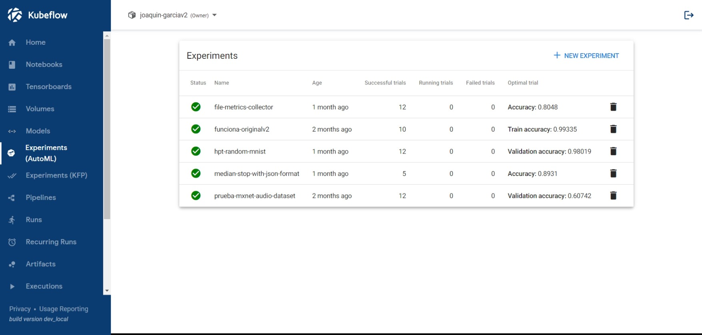
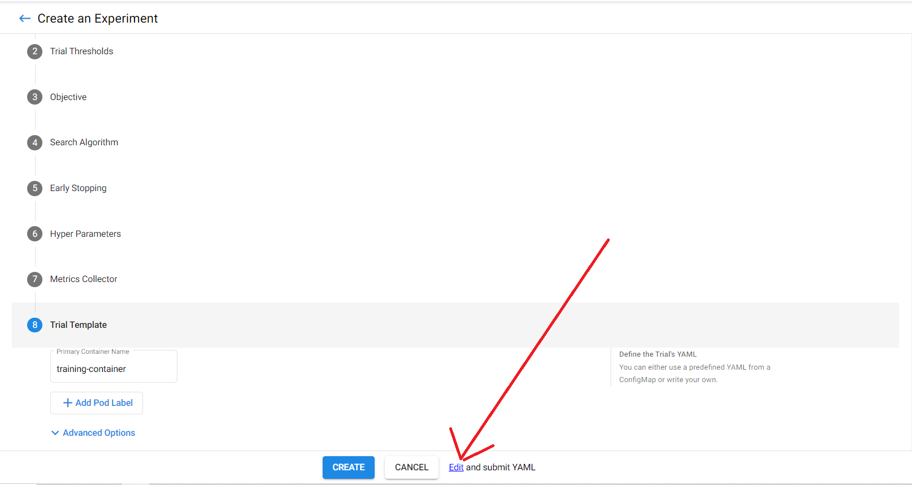
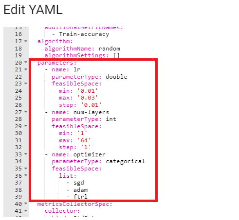
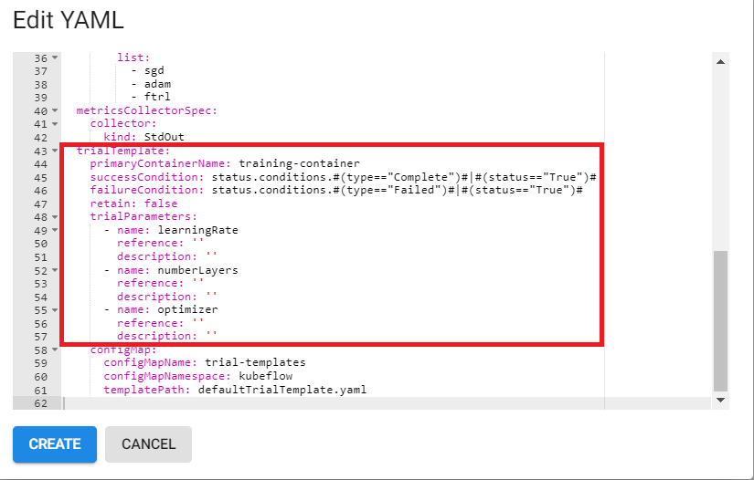
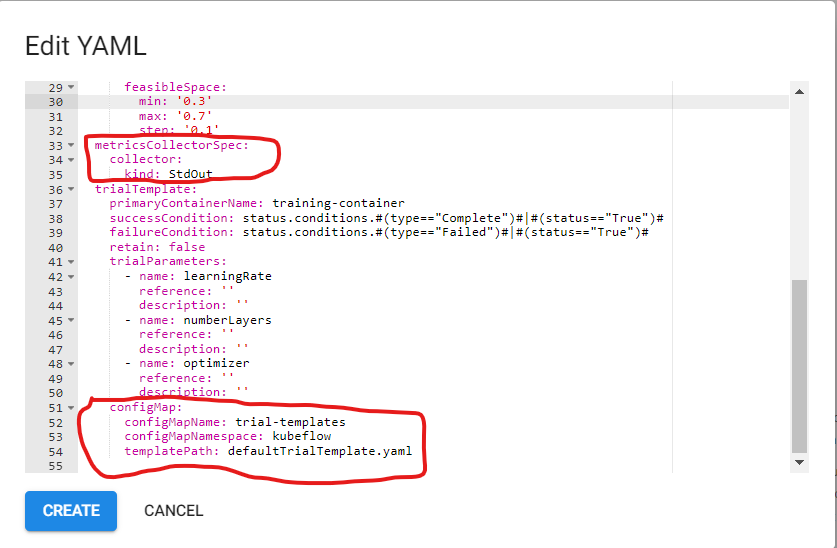

# Katib

Katib is a component of Kubernetes for automated machine learning (AutoML), supporting the implementation of Hyperparameter Tuning (HPT), Early Stopping, and Neural Architecture Search (NAS). The first is the more investigated and mature functionality, while the last is in alpha version with limited support.

## About Katib for Hyperparameter Tuning

Katib experiments can be run from the UI or by notebook.

In order to run an experiment, katib must be provided a **docker image** of the source code it is running.

A high level overview of how katib works is the following:
- The ammount of parallel trials, total trials, and maximum number of failed trials allowed is defined
* The space of possible values for the hyperparameters we are tuning is defined, along with the optimization alogrithm and other experiment data(such as the location of the output of the image)
+ katib iteratively runs the defined number of parallel trials of the provided image with a set of hyperparameters(from the search space defined by the user, chosen by the optimization algorithm)
- katib collects the output at the provided location.
* katib reports back the values of the hyperparameters and the metrics that it collected at the provided location.
+ Depending on the values of the metrics katib has collected, it calculates the new values of the hyperparameters. 
* katib runs the defined amount of parallel trials again, with the new hyperparameter values. 
* This cycle repeats until either the maximum number of trials or the maximum number of failed trials has been achieved.

In order for katib to be able to run the provided docker image with the given hyperparameters the hyperparameters must be parsed by the argparse library. 

In order for katib to be able to collect the provided metrics, the metrics must be outputed (in the source code) in the format that katib expects them to be. This format is defined in the YAML configuration of katib.

In the images folder, Three very simple docker images (and their sources) have been provided. These examples should be simple enough for a user to understand how the above mentioned principles are used.

*One imporant note is that thus far we have not been able to connect a persisted volume to katib trials. As such if you are using katib you will either have to include the dataset for your code in the image itself, or your code must have the ability to download the needed data as it's running.(as is the case with the mnist examples)*

*Another important note is that the Katib-Simple example and the Katib-Pytorch-Mnist examples both use logging to provide Katib their outputs, whereas the Katib-Tensorflow-Mnist example does not. This is because Katib has multiple job operators it can use. For generic tasks (such as the Katib-Simple example, which has a hardcoded output) or for pytorch code(such as the Katib-Pytorch-Mnist example) we use the generic **Job** operator, while for Tensorflow code we use the **TFJob** operator, which can collect the metrics from the stdout automatically. The difference in the YAML configuration between these examples can be seen in the ipynb files folder. We have not been able to collect the metrics automatically via the **TorchJob** operator thusfar, so this workaround was used.*

### Running Katib via UI

*Katib Experiments*

In order to run a new experiment, one can press the *NEW EXPERIMENT* button on the top right of the page. Doing this will lead to a straight-forward UI that can be filled with the desired values.

At Step 6, the hyperparameter step, the user should delete the the unnecessary hyperparameters and add the desired ones.

At Step 7, Metrics Collector the user should leave it as Stdout

At step 8 the *Trial Template*, the user should once more leave it as it is.

This last step is where the docker image, as well as the commands the image shuld be run with are set.

Since the predefined configMap cannot be changed, the user must press the small *edit and submit YAML* button. 

The defined parameters can be found here

While the trial parameters must be changed by adding a reference to the earlier defined parameters

Next, replace the *metricsCollectorSpec* field. As well as the *configMap* at the bottom with the *metricsCollectorSpec* and the *trialSpec* provided in the YAML template folder.

Finally the user must adapt the trial parameters, the docker image and the commands it should be run with to fit their purpose.

After this is completed, pressing create will start the katib experiment.

### Running Katib via Notebook

Multiple example notebooks have been provided in the ipynb files folder. The gist of how a katib experiment is defined via notebook is that instead of using the YAML files directly, we create python objects of the fields in the YAML files, which we then use to create the trial via the KatibClient object.

More information can be found here:
- [Github Official SDK](https://github.com/kubeflow/katib/tree/master/sdk/python/v1beta1/docs)

## References

- [Github Official Repository](https://github.com/kubeflow/katib)
- [Katib Official Website](https://www.kubeflow.org/docs/components/katib/overview/)

