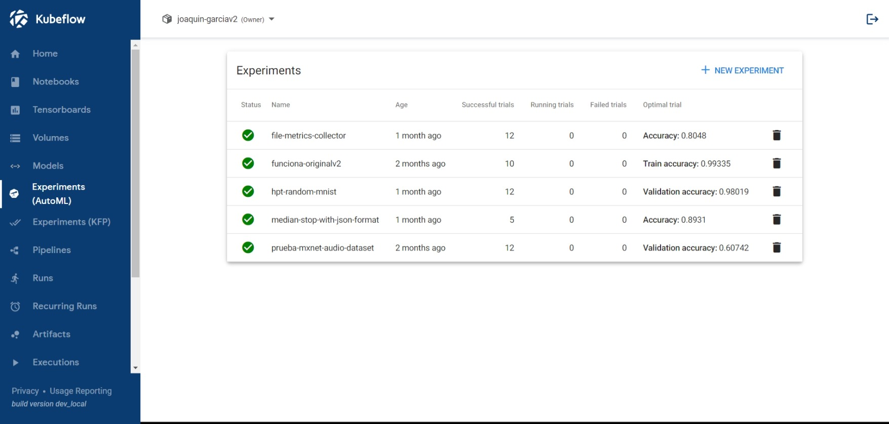
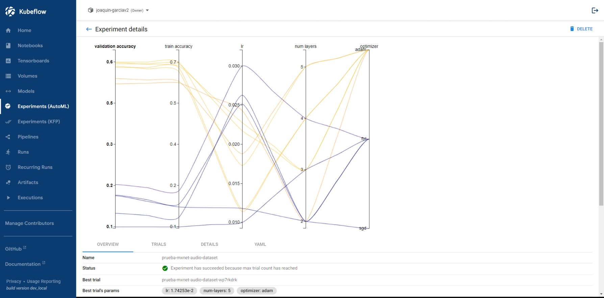
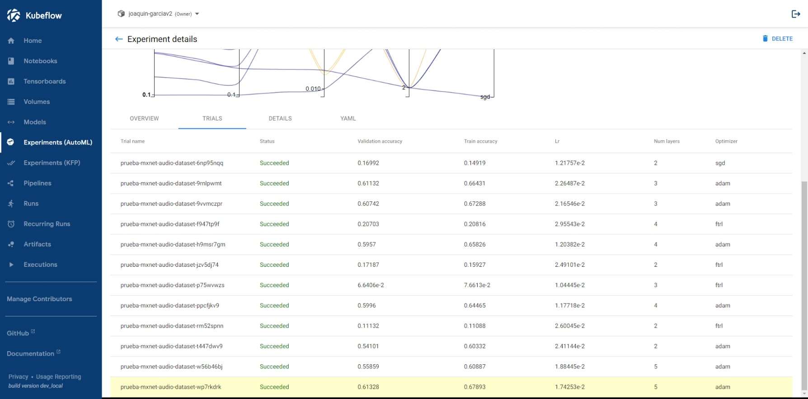
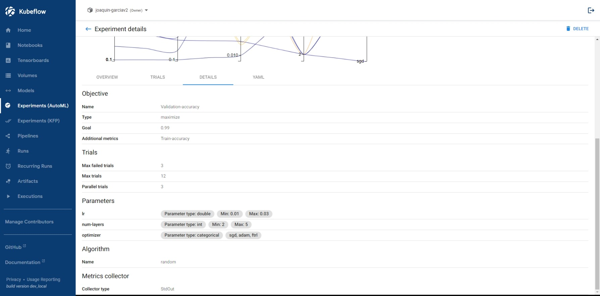
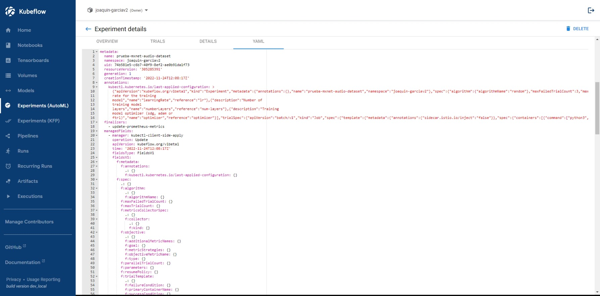

# Katib

Katib is a component of Kubernetes for automated machine learning (AutoML), supporting the implementation of Hyperparameter Tuning (HPT), Early Stopping, and Neural Architecture Search (NAS). The first is the more investigated and mature functionality, while the last is in alpha version with limited support.

## Installation

The installation of Katib can me made as part of Kubeflow, or standalone. The minimal requirements to install it are:

- Kubernetes >= 1.23
- `kubectl` >= 1.23

The [Kubeflow installation](https://www.kubeflow.org/docs/started/getting-started/) includes Katib, but in case we want to install it standalone, or to get a later version, the following command must be run:

```bash
kubectl apply -k "github.com/kubeflow/katib.git/manifests/v1beta1/installs/katib-standalone?ref=master"
```

This command will deploy the main Katib components:

- `katib-controller`: it manages Kubernetes CRDs.
- `katib-ui`: the user interface.
- `katib-mysql`: the GRPC API server to control DB interface.
- `katib-db-manager`: the DB backend to store experiment metrics.
- (Optional) `katib-cert-generator`: the certificate generator for Katib standalone installation. 

To check that they are running, we can run the following command:

```bash
kubectl get pods -n kubeflow
```

After a few seconds, the output must show all of them with "Running" status, except for the `katib-cert-generator`, which, in case of appearing, must show "Completed" status.

Once installed, the Katib UI must be available to submit and monitor experiments. More info about the Katib UI can be found in [the specific section](#katib-ui).

## Introduction to Katib concepts

The main concepts or terms used in Katib will be described in this section: **Experiment**, **Suggestion**, **Trial**, **Worker job**.

- **Experiment**: single tuning or optimization run. Each experiment can be set through different configurations, including the *objective*, the *search space* or the *search algorithm*.
- **Suggestion**: set of hyperparameter values proposed in the tuning process. A trial is created to evaluate them.
- **Trial**: iteration of the HPT process. A trial corresponds to a worker job with a suggestion. Each experiment runs several trials until it reaches the objective or the maximum number of trials.
- **Worker job**: process that runs a trial and calculates its objective value. It can be any type of Kubernetes custom resources CRD (extensions of the Kubernetes API), thus supporting the model training with the most used ML frameworks: TensorFlow (TFJob), PyTorch (PyTorchJob), Apache MXNet (MXJob), XGBoost (XGBoostJob), MPI (MPIJob), etc.

## Guide to run an experiment

To execute a Katib experiment, some steps must be carried out before, including the packaging of the training code, the experiment configuration, and the experiment running. 

### 1. Packaging of the training code

The first step is to package the training code in a Docker container image, which must be available in a Docker registry.

### 2. Experiment Configuration

Once the training code is available in a registry, the experiment must be defined in a YAML configuration file, which includes the configuration of the parameters to optimize, the search space, the objective metric, the search algorithm for optimizing the parameters, etc. In the following lines we will explain in detail each of the fields:

The *configuration metadata* allows us to specify the `namespace` in which the experiment will be deployed (*kubeflow* by default) and the `name` of the experiment, which may or may not coincide with the name of the YAML file. For clarity and reproducibility of a experiment, we recommend to make both names match.

The *configuration spec* includes the main parameters of the experiment.

- `objective`: the metric to optimize. It includes the following fields:
  - `objectiveMetricName`: e.g., *validation-accuracy*.
  - `additionalMetricNames`: additional metrics we want to monitor. E.g.: *train-accuracy*.
  - `type`: the way we want to optimize the parameters. Possible values: *maximize*, *minimize*.
  - `goal`: parameter value we want to reach. E.g.: *0.99*.
  - `metricStrategies`: the rules to extract metric values. It includes the fields `name` and `value` (possible values: *min*, *max* or *latest*).

  If the `objectiveMetricName` metric reaches the set `goal`, no new combinations of hyperparameters are tested. If `goal` is not defined, the experiment continues until the number of successful trials reaches `maxTrialCount` value, or the number of failed triales reaches `maxFailedTrialCount` value.

- `algorithm`: the search algorithm to find the best hyperparameters or neural architecture. The supported algorithms continues to grow, but currently the available ones are: Grid search, Random search, Bayesian optimization, Hyperband, Tree of Parzen Estimators (TPE), Multivariate TPE, Covariance Matrix Adaptation Evolution Strategy (CMA-ES), Sobol’s Quasirandom Sequence, Neural Architecture Search based on ENAS, Differentiable Architecture Search (DARTS), and Population Based Training (PBT). All of them are described in detail [here](https://www.kubeflow.org/docs/components/katib/experiment/#search-algorithms-in-detail).
- Fields related to the trial counts. These are:
 
  `parallelTrialCount`: maximum number of hyperparameters trained in parallel (3 by default). In our particular experience deploying experiments in the FlexiGroBots cluster, increasing the number of running pods to more than 3 in parallel made the resource management more inefficient, exponentially increasing the training times. However, we can not generalise this conclusion to other clusters.
  
  `maxTrialCount`: maximum number of trials to run.
  
  `maxFailedTrialCount`: maximum number of trials to fail. If this number is reached, the experiment finishes with *Failed* status.
- `parameters`: hyperparameters or other parameters we want to tune. Katib will generate combinations of hyperparameters in the range provided. The following fields must be included for each hyperparameter in the list:
  - `name`.
  - `parameterType`. Possible values: *int*, *double*, *discrete*, *categorical* or *unknown*.
  - `feasibleSpace`. It can be defined through `Min`, `Max` and (optional) `Step`, in case of having a numeric parameter, e.g. lr, of double type, which varies from 0.01 to 0.05 in steps of 0.01.
    In case of having a categorical type, it can be defined thorugh a `List` of possible values, e.g. optimizer, with "sgd", "adam" or "ftrl" as possible values.

- `earlyStopping`: this field allows us to stop the experiment trials when the `objective` does not improve, thus avoiding overfitting, saving computing resources and reducing execution times. It works only with *StdOut* or *File* metric collectors. The following fields must be set:
  - `algorithmName`: *medianStop* by default. It is the only algorithm available at the moment. 
  - `algorithmSettings`. Possible values: *min_trials_required* and *start_step*.

  More information about early stopping is available [in this site](https://www.kubeflow.org/docs/components/katib/early-stopping/), and a YAML configuration file which uses this method can be found [here](https://github.com/kubeflow/katib/blob/master/examples/v1beta1/early-stopping/median-stop.yaml).
- `trialTemplate`: (...)
- `metricsCollectorSpec`. This field indicates how to collect the metrics from each trial (accuracy, loss, etc.), which can be recorded into *StdOut*, or into output files. The metrics are collected using a sidecar container.  (...)
- `resumePolicy`. Possible values: *LongRunning* (by default), *Never* or *FromVolume*. Depending on the chosen one, we will be able to restart the experiment or not, and the Deployment and Service will be deleted or will continue running. More info about resuming an experiment can be found in [the documentation](https://www.kubeflow.org/docs/components/katib/resume-experiment/#resume-succeeded-experiment).

### 3. Experiment Running

In this section, we will describe how to run the experiment from the command line. First of all, we must ensure that the Kubeflow namespace provided in the YAML file has been changed to our profile namespace. In addition, we must disable the sidecar injection in case our Kubeflow is using lstio. We can do it by placing the corresponding annotation in the YAML file, as explained [here](https://www.kubeflow.org/docs/components/training/tftraining/#what-is-tfjob).

After that, we can launch the experiment running the following command:

```bash
kubectl apply -f <path/experiment-config.yaml>
```

Once running, the status of the experiment can be checked using the following command:

```bash
kubectl -n kubeflow describe experiment <experiment-name>
```

The experiment submission can also be done in the Katib UI, as described [here](https://www.kubeflow.org/docs/components/katib/experiment/#running-the-experiment-from-the-katib-ui).

## Katib UI

The Katib User Interface (UI) can be accessed opening the Kubeflow UI and clicking *Experiments (AutoML)* in the left-hand menu. The first screen we will see is the following one:


*Katib Experiments*

In this screen we can see the experiments that have been launched on a specific namespace, including information about its name, age, successful trials, running trials, failed trials, and optimal trial.

Clicking on one of them, we will be able to extract some more information, including 4 different tabs: overview, trials, details and YAML.


*Katib Overview Tab*

In the Overview Tab, a graph with the different parameters tested (e.g.: learning rate, number of layers, optimizer) and metrics obtained (validation accuracy, train accuracy) is shown. In addition, we can check the status of the experiment (e.g.: succeeded) and the reason why, if that is the case, the experiment has finished (e.g.: the experiment has succeeded because max trial count has reached), the name of the trial which gets the best results (e.g.: : *prueba-mxnet-audio-dataset-wp7rkdrk*
), etc.


*Katib Trials Tab*

Regarding Trials Tab, the list of trials have been tested along all the experiment are shown. The one which got the best objective metric is highlighted in yellow. Clicking on any of the trials, we can extract more information about the training process, including a graph with the values of the objective metrics over time.


*Katib Details Tab*

In the Katib details, the parameters we set in the YAML file are summarized (objective metrics, trials, parameters, search algorithm, or metrics collector).


*Katib YAML Tab*

Lastly, the YAML tab present the configuration file we uploaded either by command line or by the UI itself, but with extra information compared with the original file:
- The *configuration metadata* contains new fields apart from `name` and `namespace`, including `uid` (identifier of the experiment), `resourceVersion`, `generation`, `creationTimestamp`, `annotations`, `finalizers`, `managedFields`.
- The *configuration status* is created, including the following new fields: `startTime`, `completionTime`, `conditions`, `currentOptimalTrial`, `succeededTrialList`, `trials`, `trialsSucceeded`.

## Examples

In the folder *examples* you will find some examples (this number will be increased periodically) of configuration files ready to be launched in your personal namespace. Remember to change the namespace.

### MNIST example

The *mxnet-mnist.yaml* example uses the well known MNIST dataset, which aims at classifying image digits from 0 to 9. It is very similar to the *random.yaml* configuration file from the official repository, but including the `metricsCollectorSpec` field, without which the metrics in each trial were not collected properly, and the experiment did not generate new trials. The used Docker image is hosted in [the Docker repository *kubeflowkatib*](https://hub.docker.com/u/kubeflowkatib). It is a good start for testing parameters such as the number of counts, the parameters to be optimized, or the different search algorithms.

To launch the experiment, you must clone the repository and execute the following command:

```bash
kubectl apply -f ./examples/mxnet-mnist.yaml
```

### REALISED example (acoustic dataset)

In the *mxnet-realised-dataset.yaml* example, sound event classification tasks are tested in the [ReaLISED dataset](https://zenodo.org/record/6488321#.Y7wfK_6ZOUl), trying to classify up to 18 different acoustic sources. In this case, the Docker image is hosted in a [personal repository](https://hub.docker.com/repository/docker/joaquingarciaatos/mxnet-audio-dataset/), where the full dataset as well as the code is available. The machine learning library used is Apache MXNet, as in the previous example. In this case Mel-Spectrogram features are extracted to convert the acoustic raw files into images.

To launch the experiment, you must clone the repository and execute the following command:

```bash
kubectl apply -f ./examples/mxnet-realised-dataset.yaml
```

## References

- [Github Official Repository](https://github.com/kubeflow/katib)
- [Katib Official Website](https://www.kubeflow.org/docs/components/katib/overview/)
